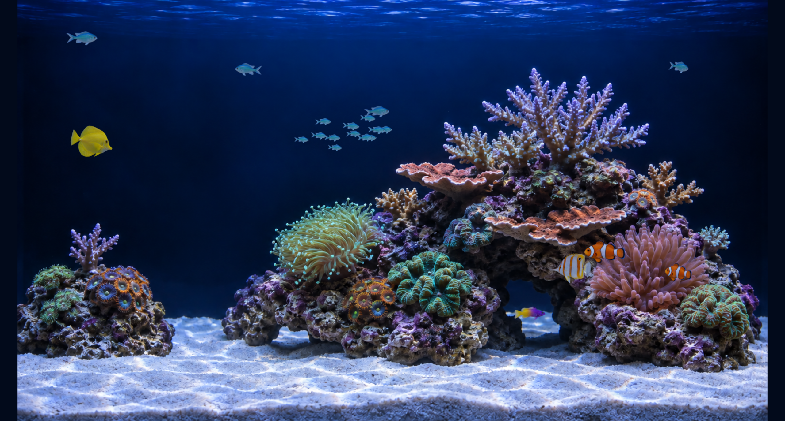

# Deep Reef · 深蓝珊瑚缸

A quiet, offline saltwater aquarium for macOS and the browser — with a reusable Codex Skill.

写实深蓝珊瑚缸：独立鱼群、轻微水流与珊瑚摆动、投喂、鼠标互动、三种灯光和节能档位。

**实现方式：固定视角 2.5D。** 背景为原创 AI 生成图，鱼是独立变形网格上的透明贴图。珊瑚局部使用图像位移；不是可以自由绕行的完整三维珊瑚场景。底图分辨率为 1672×941，在高分屏上会放大。没有账号、外部接口、分析统计或运行时 AI 调用。



## 浏览器预览

Node.js 20+，支持 WebGL2 的现代浏览器：

```sh
npm start
```

打开终端输出的 `http://127.0.0.1:4783`。无需安装 npm 依赖。端口冲突时使用 `PORT=4784 npm start`。按 Control+C 停止服务。不能直接双击 HTML 文件。

- 鼠标靠近鱼群会轻微避让；点击水面或“投喂”按钮喂鱼。
- 空格：暂停/继续；F：全屏；H：隐藏/显示界面。快捷键在表单控件未聚焦时生效。
- 深蓝展缸、月光、清透日光三档。画质：节能 20 / 均衡 30 / 精细 60 帧上限。
- 偏好保存在浏览器本地。首次访问尊重系统“减少动态效果”；页面隐藏时停止动画。

## Mac 应用

macOS 13+、Xcode Command Line Tools，按本机架构编译：

```sh
sh scripts/build-macos.sh
open -n 'build/Deep Reef.app' --args --preview
```

确认窗口预览后，安装为桌面壁纸：

```sh
sh scripts/install-macos.sh
```

安装至 `~/Applications/Deep Reef.app`，添加当前用户的登录启动项。菜单栏鱼图标可投喂、切换灯光、暂停或退出。其他动态壁纸可能遮挡它，需要自行退出另一款壁纸。安装器不会删除或停止 Desktop Habitats，也不会更改静态壁纸。

应用使用临时网页数据存储；原生暂停和灯光保存在 macOS 用户偏好中。低电量模式、屏幕睡眠、锁屏和桌面被遮挡时会降低或停止渲染。电池消耗未经过实机长时测量。

构建为 ad hoc 签名，不是 Apple 公证发布包。首次安装缺少工具时运行 `xcode-select --install`。如果所选 Xcode 未就绪，但已安装独立 Command Line Tools，构建脚本可使用后者。

卸载：`sh scripts/uninstall-macos.sh`。仅将 Deep Reef 应用与启动项移至废纸篓，保留偏好及其他壁纸。

## 安装 Codex Skill

```sh
sh scripts/install-skill.sh
```

安装到 `${CODEX_HOME:-$HOME/.codex}/skills/deep-reef`。如果已有同名 Skill，脚本停止并提示比较版本。重新打开 Codex 会话后可请求：

> 使用 $deep-reef 预览深蓝海水缸，确认动态效果后帮我应用到 Mac 桌面。

Skill 自带运行资产和安装脚本。它不会因为被加载而自动修改桌面。

## 开发与素材

`npm test` 验证模拟状态、设置和本地服务器边界。视觉及 native QA 见 [验证记录](docs/verification.md)。应用素材说明与提示词记录见 [素材来源](docs/assets.md)。运行期间全部资源来自本机。

代码使用 MIT 许可。macOS host 改编自 Chase Lean 的 [Desktop Habitats](https://github.com/chaseleantj/desktop-habitats)，保留 MIT 声明。Three.js 0.180.0 也以 MIT 许可随包分发。生成素材单独说明于 [THIRD_PARTY_NOTICES.md](THIRD_PARTY_NOTICES.md)。

### 纯净画面与鱼群
画面无标题和说明文字，默认隐藏控制栏。共 5 种、21 条鱼：2 条小丑鱼、4 条独立游动的青魔、1 条黄吊、1 条皇家草莓、1 条铜带蝶，以及 12 条群游小青魔。按 H 显示图标控制栏；空格暂停或继续，点击水面投喂。
